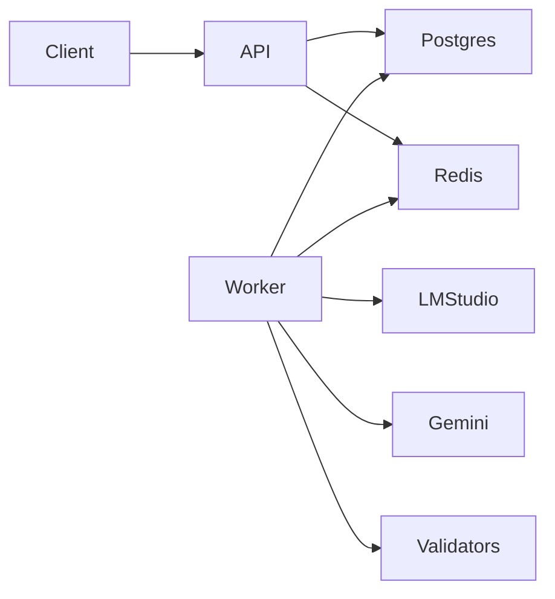
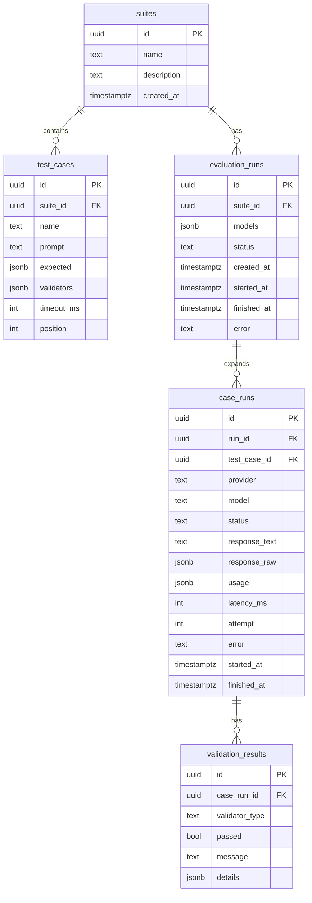
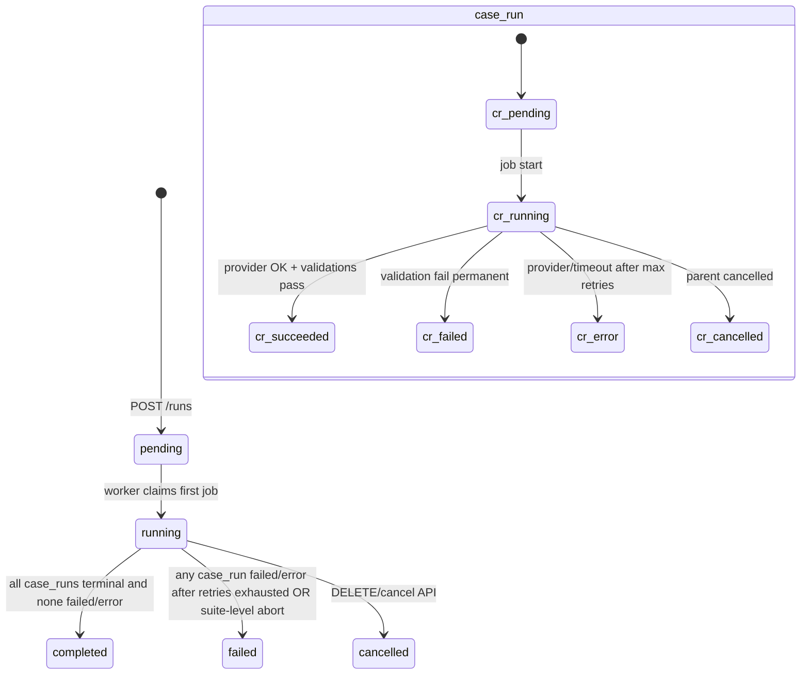

# LLM Evaluation Runner — Architecture & Implementation Plan

## Design stance

Build a **thin orchestration system** around LLM calls: define suites → enqueue work → execute with timeouts/retries → validate deterministically → compare later. V1 is intentionally incomplete (no LLM-as-judge, no OpenTelemetry yet) but the seams stay open.

**Concrete stack (locked for V1):**

- Go 1.22+, module `github.com/cu7ious/the-judge` (adjust module path as you prefer)
- HTTP: `net/http` + [chi](https://github.com/go-chi/chi) (lightweight, stdlib-friendly)
- DB: PostgreSQL + [pgx/v5](https://github.com/jackc/pgx) + [goose](https://github.com/pressly/goose) migrations
- Queue: Redis + [asynq](https://github.com/hibiken/asynq) (retries, dead-letter, concurrency out of the box; domain stays queue-agnostic)
- Logging: `log/slog` JSON to stdout
- Config: env vars only (no YAML framework)
- Containers: multi-stage Dockerfile; `docker-compose` for Postgres, Redis, api, worker

**Why asynq instead of a hand-rolled Redis list:** production-minded failure handling with little code. You still learn the hard parts (idempotency keys, state transitions, context cancellation, partial failure) in _your_ domain layer—not by reimplementing ACK/visibility timeout. Swapping to River (Postgres jobs) later is feasible if you want one less dependency.

---

## What you will learn (highest-value seams)

| Area                | Where it shows up                                                                   | Why it teaches                                    |
| ------------------- | ----------------------------------------------------------------------------------- | ------------------------------------------------- |
| Go concurrency      | Worker pool, per-case goroutines with `errgroup`, shared run aggregator             | Context, cancellation, race on status updates     |
| Background jobs     | asynq handlers; enqueue from API                                                    | Process boundaries, at-least-once delivery        |
| Retries             | Provider 5xx/timeouts → retry; validation failures → no retry                       | Distinguish transient vs permanent                |
| Idempotency         | Job ID = `case_run_id`; unique constraints; “claim then execute”                    | Duplicate delivery is normal                      |
| Observability       | slog fields (`run_id`, `case_id`, `provider`, `attempt`); OTel hooks later          | Correlation without a full tracing stack yet      |
| Distributed failure | Provider hangs, Redis down mid-job, API crash after enqueue, worker crash mid-write | Exactly the modes this project exists to practice |

CRUD endpoints are the scaffolding; the **execution pipeline** is the curriculum.

---

## Component map



| Component                                                                      | Responsibility                                                               | Deliberate non-responsibility |
| ------------------------------------------------------------------------------ | ---------------------------------------------------------------------------- | ----------------------------- |
| **API** (`cmd/api`)                                                            | Auth-less REST, validation of input, create runs, enqueue jobs, read/compare | No LLM calls, no long work    |
| **Domain** (`internal/domain`)                                                 | Suite/case/run entities, state machine rules, “can transition?”              | No SQL, no HTTP, no Redis     |
| **Providers** (`internal/provider`)                                            | `Provider` interface; LM Studio (OpenAI-compatible HTTP); Gemini             | No persistence, no validation |
| **Validation** (`internal/validate`)                                           | Deterministic checkers + `Validator` interface                               | No I/O                        |
| **Persistence** (`internal/store`)                                             | Postgres repositories                                                        | No business orchestration     |
| **Jobs** (`internal/jobs`)                                                     | Payload types, enqueue helpers, asynq task names                             | Thin adapter over asynq       |
| **Worker** (`cmd/worker`)                                                      | Pull jobs, orchestrate case execution, update DB, apply validators           | No public HTTP                |
| **Config / logging / observability hooks** (`internal/config`, `internal/obs`) | Env load, slog setup; empty OTel stubs or interfaces                         | No business logic             |

**Tradeoff:** two binaries (`api` + `worker`) costs a bit more docker-compose wiring but forces you to treat the API as a control plane and the worker as an execution plane—closer to real systems than an in-process goroutine queue.

---

## Minimal folder structure

```text
.
├── cmd/
│   ├── api/main.go
│   └── worker/main.go
├── internal/
│   ├── config/
│   ├── domain/          # entities, status enums, transition helpers
│   ├── api/             # HTTP handlers, request/response DTOs, middleware
│   ├── store/           # Postgres; interfaces defined here or in domain
│   ├── provider/
│   │   ├── provider.go  # interface + shared types (Request/Response/Usage)
│   │   ├── lmstudio/
│   │   └── gemini/
│   ├── validate/
│   ├── jobs/            # asynq task registration + enqueue
│   ├── runner/          # execute one case: call provider → store → validate
│   └── obs/             # slog helpers; later OTel tracer/meter wrappers
├── migrations/
├── docker-compose.yml
├── Dockerfile
├── Makefile
└── README.md
```

Keep packages shallow. Avoid `pkg/`, hexagonal folder trees, and event buses.

---

## Data model (Postgres)

Keep tables narrow; store provider payloads as JSONB.



**Notes:**

- `test_cases.expected` / `validators`: e.g. `[{"type":"contains","value":"Paris"},{"type":"json_schema","schema":{...}}]`
- `evaluation_runs.models`: `[{"provider":"lmstudio","model":"qwen2.5"},{"provider":"gemini","model":"gemini-2.0-flash"}]`
- Expand at submit time: **one `case_run` per (test_case × model)** — comparison becomes a SQL/API join, not a nested blob
- Cost: store provider usage tokens in `usage` JSONB; compute estimated USD later with a simple price table in config (optional V1.1)
- Unique index on `case_runs(id)` is enough; job idempotency key = `case_run.id`

---

## Run lifecycle (state machine)



**Aggregation rule (simple, explicit):**

- Run → `running` when first case_run starts
- Run → `completed` iff every case_run is `succeeded`
- Run → `failed` if any case_run is `failed` or `error` and none remain non-terminal
- Cancel sets non-terminal case_runs to `cancelled` and best-effort cancels in-flight via context (worker checks run status / Redis cancel flag)

**Retry policy:**

- Transient provider errors / timeouts: retry with backoff (asynq), bump `attempt`
- Validation failure: **no retry** (deterministic)
- Context cancelled / run cancelled: no retry

---

## Initial REST API

| Method | Path                    | Purpose                                                         |
| ------ | ----------------------- | --------------------------------------------------------------- |
| `POST` | `/v1/suites`            | Create suite                                                    |
| `GET`  | `/v1/suites`            | List suites                                                     |
| `GET`  | `/v1/suites/{id}`       | Get suite + cases                                               |
| `POST` | `/v1/suites/{id}/cases` | Add test case                                                   |
| `POST` | `/v1/runs`              | Body: `suite_id`, `models[]` → create run + case_runs + enqueue |
| `GET`  | `/v1/runs/{id}`         | Run status + summary counts                                     |
| `GET`  | `/v1/runs/{id}/results` | Full case_runs + validation_results (compare view)              |
| `POST` | `/v1/runs/{id}/cancel`  | Cancel run                                                      |
| `GET`  | `/healthz`              | Liveness                                                        |
| `GET`  | `/readyz`               | Postgres + Redis ping                                           |

No auth in V1. No pagination beyond simple limits. Comparison = client-side or SQL grouping by `test_case_id` across providers in `/results`.

---

## Core interfaces (learning anchors)

```go
// Provider — swap LM Studio / Gemini / future OpenAI without touching workers
type Provider interface {
    Name() string
    Complete(ctx context.Context, req CompletionRequest) (*CompletionResponse, error)
}

// Validator — deterministic now; LLM-judge later implements same interface
type Validator interface {
    Type() string
    Validate(ctx context.Context, in ValidationInput) ValidationResult
}

// Store — persistence boundary for tests with fakes
type Store interface {
    // suites, cases, runs, case_runs, validation_results CRUD + status transitions
}
```

**Runner flow (one case_run job):**

1. Load case_run + test_case; if not `pending`, exit OK (idempotent)
2. Transition → `running` (optimistic: `UPDATE ... WHERE status='pending'`)
3. `context.WithTimeout` from `timeout_ms`
4. `provider.Complete`
5. Persist response, latency, usage
6. Run validators; persist results
7. Set terminal status; enqueue “maybe finalize run” or finalize inline with conditional SQL

---

## Failure scenarios to test deliberately

1. **Provider timeout** — short `timeout_ms`, hung handler → `error` after retries; run becomes `failed`
2. **Duplicate job delivery** — re-enqueue same `case_run_id` → second execution no-ops or safe overwrite rules
3. **Validation failure** — exact match miss → `failed`, **not** retried
4. **Invalid JSON / schema** — response text fails validators
5. **Cancel mid-flight** — cancel run while provider call in progress → context cancel; status `cancelled`
6. **Redis unavailable at submit** — API returns 503; no orphan “running” run (transaction: insert run, enqueue; or mark run failed if enqueue fails)
7. **Worker crash after provider success before DB write** — retry re-calls provider (at-least-once); document as accepted V1 behavior; optional later: store response before validate in one transaction
8. **Partial suite success** — 3 models × N cases; one provider down → mixed terminal states; run `failed` with per-case detail
9. **Context deadline on API** — create suite with huge body rejected by limits; independent of worker contexts

---

## Docker / local DX

- `docker-compose.yml`: `postgres`, `redis`, `api`, `worker` (+ optional `lmstudio` is host-network / external; document `LMSTUDIO_BASE_URL=http://host.docker.internal:1234/v1`)
- Migrations on API startup or `make migrate`
- `.env.example`: DB URL, Redis URL, `GEMINI_API_KEY`, provider base URLs, asynq concurrency

---

## Tests (basic, high leverage)

- **Unit:** validators (table-driven); state transition helpers; provider request mapping
- **Integration (build tag or testcontainers optional):** store status transitions; one fake provider + Redis + worker handler happy path
- Prefer a `provider.Fake` that sleeps / errors / returns fixed text—teaches seams without live LLM flakiness
- Live LM Studio / Gemini: manual `Makefile` smoke targets only

---

## Extension seams (do not build yet)

| Future feature            | Hook left in V1                                                                                     |
| ------------------------- | --------------------------------------------------------------------------------------------------- |
| OpenTelemetry             | `obs` package wrapping handlers/worker with no-op; pass `context` everywhere                        |
| LLM-as-judge              | `Validator` interface; judge is just another implementation using `Provider`                        |
| Prompt/version regression | Add `prompt_versions` later; `test_cases` already versionable via new table without changing runner |
| More providers            | `Provider` registry map by name                                                                     |
| Cost dashboards           | `usage` JSONB + static price map                                                                    |

---

## Implementation milestones

Build and understand one layer at a time. Each milestone should leave the system runnable or testable.

### M1 — Skeleton & persistence

- Module, `cmd/api` health endpoints, config, slog, docker-compose (Postgres + Redis), goose migrations, `store` CRUD for suites/cases
- **Learn:** project layout, pgx, migrations

### M2 — Domain model & REST for suites/cases

- Domain types, chi routes for suites/cases, input validation
- **Learn:** handlers, DTO vs domain, errors → HTTP mapping

### M3 — Providers behind an interface

- `Provider` interface; LM Studio client (OpenAI-compatible); Gemini client; `Fake` for tests
- Small CLI or handler `POST /v1/debug/complete` (dev-only) optional—or unit tests only
- **Learn:** `context`, HTTP clients, wrapping third-party APIs

### M4 — Validators

- exact, contains, regex, valid_json, json_schema, error/timeout flags; custom interface
- Table-driven tests
- **Learn:** strategy pattern in Go, `encoding/json`, regex

### M5 — Runs + enqueue (no worker yet)

- Create `evaluation_runs` / `case_runs`; state machine helpers; enqueue asynq tasks; API `POST/GET /runs`
- **Learn:** transactions (DB write + enqueue failure handling)

### M6 — Worker execution pipeline

- `cmd/worker`; runner; timeouts; retries; idempotent claim; persist results; finalize run status; cancel
- **Learn:** the core curriculum (concurrency, jobs, retries, cancellation)

### M7 — Compare API & polish

- `GET /runs/{id}/results` shaped for side-by-side compare; README; Makefile smoke; basic integration test
- **Learn:** read models vs write path

### M8 (optional stretch) — Observability stubs

- Consistent slog attributes; comment/TODOs for OTel span names on `Complete` and job handlers

---

## Explicit non-goals for V1

- Auth, multi-tenancy, UI, websockets/SSE progress streaming
- Horizontal autoscaling guides, Kubernetes
- Streaming token responses
- LLM-as-judge, prompt versioning UI
- Perfect exactly-once provider calls
- Microservice split beyond api/worker

---

## Suggested first coding session after plan approval

Implement **M1 only**: repo skeleton, docker-compose, migrations, health checks, and one suite insert/select via store tests—so the rest of the system has a solid floor before concurrency enters the picture.
